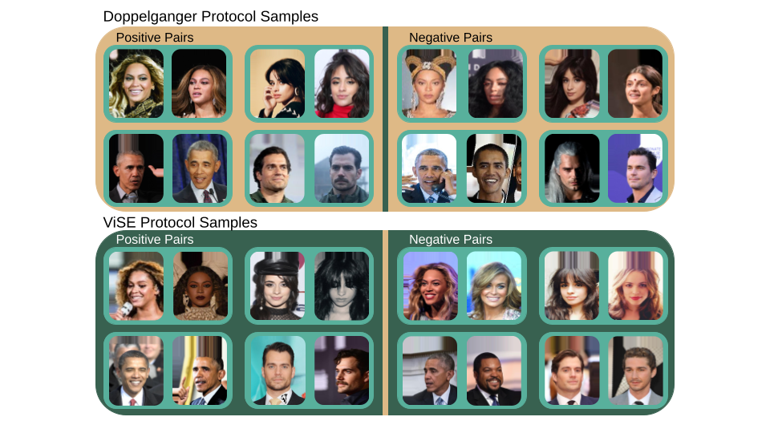

# DoppelVer: A Benchmark for Face Verification



## Table of Contents

- [Overview](#overview)
- [Requesting Access](#access)
- [Dataset Details](#dataset-details)
- [Data Description](#data-description)
- [Dataset Structure](#dataset-structure)
- [Usage](#usage)
- [Citation](#citation)
- [License](#license)
- [Code](#code)

## Overview
This repository is intended to provide documentation on the Doppelganger dataset as well as the code that we utilized for collecting, cleaning, pre-processing, and protocol generation. Please note that no data is provided here. A request for the dataset must be submitted as detailed below. 

The **DoppelVer** dataset is a benchmark dataset designed for evaluating and advancing face verification and recognition algorithms. This dataset contains a diverse collection of facial images. The identities depicted were selected in pairs of doppelganger identities. A doppelganger is an identity who is highly visually similar to the source identity, such that they might be mistaken for one another.

This README file provides essential information about the dataset, its structure, and instructions on receiving access and how to use it was intended to be used.

## Access

In order to receive access the the dataset you must request access from Dr. Emily Hand at the University of Nevada, Reno. Upon acceptance of the end user license agreement you will be provided with access to the dataset. Dr. Hand can be reached at emhand@unr.edu. Please use the following in the subject line: "DoppelVer dataset access request".

## Dataset Details

- **Dataset Name**: DoppelVer: A Benchmark for Face Verification
- **Version**: 1.0
- **Release Date**: 10/17/23
- **Number of Subjects**: 390
- **Number of Original Images**: 27,430
- **Number of Pre-Processed Images**: 27,976
- **File Format**: JPG

## Data Description

The DoppelVer dataset includes the following features and attributes:

- Doppelganger pairs: annotation of which identities are doppelgangers to one another.
- Gender: the identity's gender assigned at birth.
- Country of Origin: The country in which the individual was born in.
- Verification Pairs: protocols for evaluating face verification, including paths to two images and a label denoting if the images depict the same of different identities. 

## Dataset Structure

The dataset is organized as follows:
``` bash
DoppelVer/
├── README.md
├── doppelgangerPairs.csv
├── DoppelgangerProtocol.csv
├── ViSEProtocol.csv
├── Images.zip
├── Images/
│ ├── Original_Images/
│ │ ├── Abigail Spencer/
│ │ │ ├── 00.jpg
│ │ │ ├── 01.jpg
│ │ │ ├── etc.
│ │ ├── etc./
│ │ │ ├── 00.jpg
│ │ │ ├── 01.jpg
│ │ │ ├── etc.
│ ├── CCA_Images/
│ │ ├── Abigail Spencer/
│ │ │ ├── 00_0.jpg
│ │ │ ├── 01_0.jpg
│ │ │ ├── etc.
│ │ ├── etc./
│ │ │ ├── 00_0.jpg
│ │ │ ├── 00_1.jpg
│ │ │ ├── etc.
```
- `DoppelgangerPairs.csv/`: Doppelganger pair annotations.
- `DoppelgangerProtocol.csv/`: One of two protocols. The Doppelganger protocol uses images of a labeled doppelganger pair as negative samples for verification.
- `ViSEProtocol.csv/`: One of two protocols. The ViSE protocol uses images which are identified by a deep model as being highly visually similar.
- `Images.zip/`: A compressed file containing all original images and pre-processed images.
- `Images/`: The resultant directory after decompressing the Images.zip file.
## Usage

Intended use cases are provided in our academic paper referenced below. DoppelVer is intended to be used for the evaluation of face recognition models. The dataset does not contain sufficient samples, nor diversity to effectively train face recognition models.

## Citation

If you use the DoppelVer dataset in your work, please cite it as:
N. Thom, A. DeBolt, L. Brown, E. M. Hand, “DoppelVer: A Benchmark for Face Verification,” International Symposium on Visual Computing, 2023.

## License

This dataset is provided under our end user licence agreement.

---

## Code

SETUP TO RUN CODE TO CREATE OUR DATASET FROM SCRATCH(May contain different images, and will be different protocol(same structure)):
1. Download conda
2. Create conda enviroment
3. Follow list of downloads to get all needed packages
4. Create a folder(this will be where all datasets will be stored as well as all csvs)
5. put doppelgangerPairs.csv and IndividualGenderCountryOrigin.csv into that folder
6. update datasets_save_location variable inside controller.py to be the path from home to the folder you created
7. update number_of_images_to_download variable inside controller.py to be the number of base images you want to download for each individiual

The provided code will 
1. collect data given a list of names
2. convert the collected images into headshots
3. remove duplicates(this part is manual, and will also need a manual look over the whole collected dataset to remove bad images)
4. create the doppelganger protocol, with splits
5. create the ViSE protocol, with the same individuals in the same splits
6. allow for easy access of the data through prewritten dataloaders, in pytorch, tensorflow and hugging face

To run each section of code
1. Collecting data:

    To run this code you need to provide a list of names to collect, a number of images to collect for each name, and a save path location

    The output of this code will be a folder for each name, containing the number of images you declared, in the save path location

2. Covert downloaded images, into CCA images(1 downloaded image can become multiple CCA images):

    To run this code you need to provide the save location of the downloaded images, and the desired save location of the CCA images

    The output of this code will be a new folder containing one folder for each individual, with the number of images being the number of faces found in the original images, the name of these new images will be, id_of_original_image_id_of_face_found.jpg, or XXX_XX.jpg, where XXX is the id of the original image, and XX is id of face found in the original image

3. Remove duplicates:

    To run this code you need to provide the save location of the CCA images

    The code will find images that are near each other(look similar) and ask if the two images it shows are the same/mirrored/off color, if its any of these three it will delete one and continue, after this step manually go through all images and remove an images that dont belong in the folder they exist in

4. Creating the Doppelganger protocol:

    This code requires the save location of the cleaned CCA images, a list of doppelganger pairs, and a list of each name and their gender

    This code outputs a list of samples, where each sample is in the form of, name 1, image 1, name 2, image 2, label, split. Label is 0 if name1 and name2 are different and 1 if they are the same. Split represnets which cross validation split that sample belongs to, this can be numbers 0-9, and each split is identity unique, so if an identity shows up in one split it will not show up in any other splits

5. Creating the ViSE protocol:

    This code requires the save location of the cleaned CCA images, and a completed Doppelganger protocol with the name doppelgangerProtocol.csv
    
    This code outputs a list of samples in the same form as the Doppelganger protocol, however the negative samples were generated by finding images with minimum distance between them(visually similar images)
    
6. Dataloaders:

    This code requires the dataset, one of the protocols, and a number of the desired framework(PyTorch, TensorFlow, HuggingFace)

    This code outputs 2 images and a label for each instance its called, these images and labels are drawn from a sample in the current split, during training no images will be drawn from the test split, during testing only images will be drawn from the test split

---

We hope you find the DoppelVer dataset valuable for your research or application. If you have any questions or need further assistance, please don't hesitate to contact us at nathanthom@nevada.unr.edu or emhand@unr.edu.
